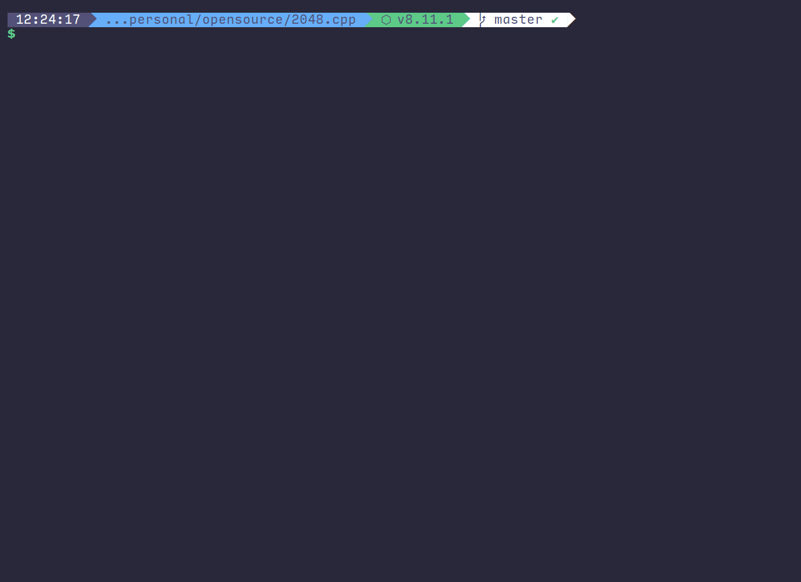

# 2048.cpp

[](https://travis-ci.org/plibither8/2048.cpp)
[](https://ci.appveyor.com/project/plibither8/2048-cpp)
[](https://app.codacy.com/app/plibither8/2048.cpp?utm_source=github.com&utm_medium=referral&utm_content=plibither8/2048.cpp&utm_campaign=Badge_Grade_Dashboard)
[](https://lgtm.com/projects/g/plibither8/2048.cpp/context:cpp)
[](https://madewithlove.org.in/)
[](https://repl.it/github/plibither8/2048.cpp)

> Terminal version of the game "2048" written in C++.

:tada: Featured on GitHub's [Twitter](https://twitter.com/github/status/1017094930991370240) and [Facebook](https://www.facebook.com/GitHub/videos/1433491453419807/) pages! :tada:

<p align="center">
    </img>
</p>

## Setup

The game and code is made to run natively on the GNU/Linux and MacOS platforms, but cross-platform compatibility for Windows has been added too.

### Requirements

* C++11 compiler (e.g. `g++`, `clang++`, `pgc++`, `icpc`, etc.)
* Virtually any platform including:
  * Linux
  * MacOS
  * Windows (via Cygwin or Windows Subsystem for Linux)
* [CMake](https://cmake.org/) or [Meson](https://mesonbuild.com/)

### Installation

1. Open your terminal in your preferred directory and clone this project:
```sh
git clone https://github.com/plibither8/2048.cpp
```
2. Enter the project's build directory:
```sh
cd 2048.cpp/build
```

---

For both CMake and Meson, the default C++ compiler on your system will be used.
If you wish to manually select a C++ compiler, optionally add `CXX=clang++ cmake` or `CXX=clang++ meson` etc.

#### Building with CMake

3. Generate build configuration
```sh
cmake ../
```
4. Build the executable
```sh
cmake --build .
```
5. Install the program (optional)
```sh
cmake --build . --target install
```

6. Run the program and play the game! :tada:
```sh
2048    # run `./2048` if game is not installed
```

<p align="center">
    <b>OR</b>
</p>

#### Building with Meson

3. Generate build configuration
```sh
meson ../
```
4. Build the executable
```sh
ninja
```
5. Install the program (optional)
```sh
meson configure --prefix=$HOME/.local
ninja install
```

6. Run the program and play the game! :tada:
```sh
2048    # run `./2048` if game is not installed
```

## Contributing

First of all, thank you for contributing :smile:! A few things to note:

* If you have found a bug, or have a feature that you'd like implemented, [raise an issue](https://github.com/plibither8/2048.cpp/issues).

* If you have proposed a pull request, make sure that you run `clang-format` on the source code (both, `.cpp` and `.hpp`) files if you've made changes there.

* In your local repository, run `git update-index --skip-worktree ./data/*.txt` to ensure that changes to the data files are not tracked by git, and thus are not staged.

## Thanks

I deeply appreciate the help of the following people:

* [Michael Hirsch](https://github.com/scivision)
  * cleaned up the code,
  * organised the header files in a better way for a more efficient build,
  * added the AppVeyor CI,
  * added the Meson build system and, fixed CMake and added install feature.
* [Aiman Ismail](https://github.com/pokgak) added support for Vim keybinding.
* [Patrik Huber](https://github.com/patrikhuber) fixed a typo in the Readme.
* [zestze](https://github.com/zestze) changed `cstdlib rand` to C++ random int generator.
* [Pascal J. Bourguignon](https://github.com/informatimago) added support for ANSI arrow keys.
* [Jean-Michaël Celerier](https://github.com/jcelerier) added `CMakeLists.txt` file.
* [comwrg](https://github.com/comwrg) made the duration in the statistics and highscores human-readable, wrapping seconds to minutes and hours.
* [Christian Bundy](https://github.com/christianbundy) replaced the ugly -, + and | with box-drawing characters.
* [Tor E Hagemann](https://github.com/hagemt) fixed issue #10, causing unwanted character `1` to be printed.
* [farazxameer](https://github.com/farazxameer) implemented feature to save a game state and continue from a saved game state, refined game logic.
* [drodil](https://github.com/drodil) implemented checks to ascertain existence of data files, fixed issue #12
* [Aviskar KC](https://github.com/aviskarkc10) added arrow keys to game instructions.
* [Peter Squicciarini](https://github.com/stripedpajamas) fixed readme instructions.
* [Mark Fischer, Jr.](https://github.com/flyingfisch) fixed a typo.
* [Hugo Brandão](https://github.com/jhugobb) completely reorganised the existing project structure and updated the build method to enfore CMake.
* [Alton Alvarez](https://github.com/mathematicalist) fixed a typo.
* [cawvyoct](https://github.com/cawvyoct) made the source code much, much easier to read: removed most magic numbers, replacing them with variables to ease maintenance. Implemented `clang-format`.
* [Cong](https://github.com/cxong) edited the `Game` class constructor.
* [Tien Do](https://github.com/tiendq) added the 'exit' option in the main menu, updated the `CMakeLists.txt` file and made `Color` enum to a scoped enum.
* [ScorrMorr](https://github.com/ScorrMorr) made many methods `const`s.
* [tangmengqiu](https://github.com/tangmengqiu) fixed an error-causing instruction step in the readme.

### Maintainers

* [Mihir Chaturvedi](https://github.com/plibither8)
* [cawvyoct](https://github.com/cawvyoct)

## Notes

`[GameBoard].getTile(2,0)` refers to the 0th tile (or column) in 2nd row as in this case, x = 0 and y = 2. The specific tile is denoted the by '@' symbol in the following gameboard:

> Note: `row` and `column` indexing starts at 0.

```plaintext
┌──────┬──────┬──────┬──────┐
│      │      │      │      │
├──────┼──────┼──────┼──────┤
│      │      │      │      │
├──────┼──────┼──────┼──────┤
│   @  │      │      │      │
├──────┼──────┼──────┼──────┤
│      │      │      │      │
└──────┴──────┴──────┴──────┘
```

## To-Do

- [x] Add start menu [19/04/2018]
- [x] Save highscore / score [21/04/2018]
- [x] Save a game state and play from a saved game state
- [ ] ~~AI~~ *(Abandoned indefinitely)*

---

## License

Copyright (c) Mihir Chaturvedi. All rights reserved.

Licensed under the [MIT](LICENSE) License.
